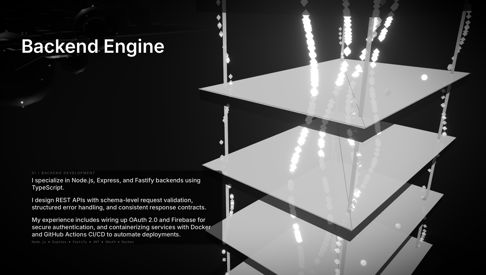

<div align="center">
  

  # 🌌 Harshit Sharma | Creative Developer Portfolio
  
  **An immersive, interactive 3D portfolio experience built with modern web technologies.**
</div>

<br />

## 🌟 Overview

Welcome to my personal portfolio repository! This project is a highly interactive, 3D-driven web experience designed to showcase my projects, skills, and creative journey. It leverages the power of **WebGL** and modern frontend frameworks to deliver a smooth and engaging user experience.

## ✨ Features

- **Immersive 3D World**: Built using React Three Fiber and Three.js for a rich, interactive 3D environment.
- **Fluid Animations**: Powered by GSAP and Framer Motion for seamless transitions and micro-interactions.
- **Smooth Scrolling**: Integrated Lenis for buttery-smooth scroll experiences.
- **Responsive Design**: Carefully crafted with Tailwind CSS to ensure a beautiful experience across all devices.
- **Performance Optimized**: Built on Next.js for optimal loading speeds and SEO.

## 🛠 Tech Stack

- **Framework**: [Next.js](https://nextjs.org/) & [React](https://react.dev/)
- **Styling**: [Tailwind CSS](https://tailwindcss.com/)
- **3D & Graphics**: [Three.js](https://threejs.org/), [React Three Fiber](https://r3f.docs.pmnd.rs/), [React Three Drei](https://github.com/pmndrs/drei)
- **Animation**: [GSAP](https://gsap.com/), [Framer Motion](https://www.framer.com/motion/)
- **Scrolling**: [Lenis](https://lenis.darkroom.engineering/)

## 📸 Sneak Peek

Here are some glimpses of the portfolio and my recent projects:

<div align="center">
  <table>
    <tr>
      <td align="center">
        
      </td>
      <td align="center">
        
      </td>
    </tr>
    <tr>
      <td align="center">
        
      </td>
      <td align="center">
        
      </td>
    </tr>
    <tr>
      <td align="center" colspan="2">
        
      </td>
    </tr>
  </table>
</div>

<br />

## 🚀 Getting Started

Follow these steps to run the portfolio locally:

### Prerequisites
Make sure you have Node.js installed on your machine.

### Installation

1. **Clone the repository**
   ```bash
   git clone https://github.com/harshitsharma/portfolio.git
   cd portfolio
   ```

2. **Install dependencies**
   ```bash
   npm install
   # or
   yarn install
   # or
   pnpm install
   ```

3. **Run the development server**
   ```bash
   npm run dev
   # or
   yarn dev
   # or
   pnpm dev
   ```

4. Open [http://localhost:3000](http://localhost:3000) with your browser to see the result.

## 📬 Contact

Have a question or want to work together? 
Reach out to me directly or connect with me on social media.

---

<div align="center">
  <i>Designed and developed by Harshit Sharma.</i>
</div>
